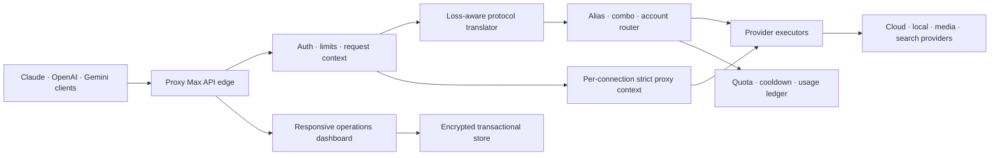

<p align="center">
  
</p>

<h1 align="center">Proxy Max</h1>

<p align="center">
  <strong>A local-first AI gateway for Claude, OpenAI, Gemini, media, search, and 100+ provider integrations.</strong><br />
  One endpoint, loss-aware protocol translation, account routing, proxy pools, usage controls, and an operator-grade dashboard.
</p>

Proxy Max now uses its audited, hardened unified integration as the default
runtime. The exact third-party v0.5.40 source tree is pinned locally,
then composed with reviewed Proxy-Max overlays. The original Proxy-Max runtime
remains available as an explicit rollback mode.

## What is included

- Anthropic Messages, OpenAI Chat Completions, OpenAI Responses, Gemini, Vertex,
  Antigravity, Kiro, Cursor, and Ollama protocol translation.
- Text, vision, PDF/document, embeddings, image generation/editing, speech,
  transcription, video, web search, and URL fetch routes.
- API-key, cookie, service-account, local, and OAuth provider connections with
  refresh, quota, cooldown, fallback, alias, and account-pool routing.
- Native AWS Bedrock SigV4/EventStream support and Azure deployment, direct
  Foundry, Chat Completions, and Responses endpoint modes.
- Per-connection proxy pools, strict no-bypass routing, relay support, tunnels,
  CLI integrations, and local MITM tooling.
- RTK, Headroom, PXPIPE, context controls, prompt-style controls, usage history,
  pricing, request diagnostics, and a redesigned responsive dashboard.
- Encrypted credential storage, secret-safe APIs/logs, transactional imports,
  loopback/local-auth boundaries, SSRF defenses, bounded I/O, and hardened
  privileged operations.

## Quick start

Requirements: Node.js 20.19.0 or newer and npm.

```bash
git clone https://github.com/TasadduqB/Proxy-Layer-For-Anthropic-Foundry-BedRock-Nvidia.git
cd Proxy-Layer-For-Anthropic-Foundry-BedRock-Nvidia

npm install
npm run unified:install
npm run unified:build
npm start
```

Open [http://127.0.0.1:8787/dashboard](http://127.0.0.1:8787/dashboard).
On a new data directory, the local setup screen creates the dashboard password
before any management data is exposed.

If the dashboard password is lost while the local runtime is running:

```bash
npm run unified:reset-password
```

The recovery command authenticates with the private machine-bound CLI token and
will only connect to a loopback host.

Point Claude Code at the Anthropic-compatible endpoint:

```bash
export ANTHROPIC_BASE_URL=http://127.0.0.1:8787
export ANTHROPIC_AUTH_TOKEN=proxy-max
claude
```

OpenAI-compatible clients use `http://127.0.0.1:8787/v1`. Principal routes are:

| Capability | Route |
| --- | --- |
| Anthropic messages | `POST /v1/messages` |
| OpenAI chat | `POST /v1/chat/completions` |
| OpenAI Responses | `POST /v1/responses` |
| Models | `GET /v1/models` |
| Embeddings | `POST /v1/embeddings` |
| Images | `POST /v1/images/generations`, `POST /v1/images/edits` |
| Speech / transcription | `POST /v1/audio/speech`, `POST /v1/audio/transcriptions` |
| Video | `POST /v1/videos` |
| Search / fetch | `POST /v1/search`, `POST /v1/fetch` |

## Runtime modes and rollback

`npm start` launches the unified runtime on loopback port `8787`.

| Mode | Command | Default port | Data |
| --- | --- | ---: | --- |
| Unified | `npm start` | 8787 | `~/.proxy-max/unified` |
| Legacy rollback | `PROXY_MAX_RUNTIME=legacy npm start` | 8787 | Existing Proxy-Max config/data |
| Parallel audit | `npm run start:parallel` | 8787 + 20128 | Isolated stores |
| Direct unified | `npm run start:unified` | 20128 | `~/.proxy-max/unified` |

Useful overrides:

```bash
PROXY_MAX_UNIFIED_HOST=127.0.0.1
PROXY_MAX_UNIFIED_PORT=8787
PROXY_MAX_UNIFIED_DATA_DIR=/private/path
PROXY_MAX_RUNTIME=legacy
```

The unified process binds to `127.0.0.1` by default, disables framework
telemetry, launches the standalone build without a shell, and never adopts an
unrelated legacy data directory implicitly.

## Import an existing Proxy-Max configuration

Migration is deliberately dry-run first. The source `config.json` is never
rewritten or deleted.

```bash
npm run unified:migrate:plan
# inspect the secret-free report under ~/.proxy-max/unified/migrations
npm run unified:migrate:apply
```

Apply starts an isolated loopback instance, exports a private backup, merges
connections/nodes/combos/settings transactionally, imports, exports again, and
verifies every planned connection. Native mappings include AWS Bedrock, Azure
deployment/direct/Responses modes, NVIDIA NIM, Cloudflare Workers AI, and
custom OpenAI-compatible endpoints.

## Provider and routing model

Connections hold credentials and provider-specific settings. Model names use
`provider/model`, alias/model, or combo/model syntax. The router can select by
explicit connection, alias, modality capability, health, quota, cooldown,
priority, sticky round robin, weighted round robin, least latency, or fallback
strategy. Request-scoped connection identity is retained through refreshes and
retries, so a request cannot silently jump accounts or bypass its strict proxy
pool.

Notable native integrations include Anthropic/Claude, OpenAI/Codex, Azure,
AWS Bedrock, Gemini, Vertex, GitHub Copilot, Cursor, Kiro, Qwen, Kimi, xAI,
OpenRouter, NVIDIA, Cloudflare AI, Ollama/local devices, ElevenLabs, Deepgram,
AssemblyAI, Stability, Runway, Tavily, Brave, Exa, Firecrawl, and many other
registry-backed services. The dashboard is the source of truth for the exact
models and connection fields in the pinned build.

## Security model

- Dashboard/API credentials are encrypted at rest and redacted from reads,
  exports, logs, errors, and diagnostics.
- Management APIs require dashboard authentication outside loopback, even when
  password-free local mode is selected. Update, tunnel, MITM, filesystem, and
  process-control operations additionally require a genuine local request;
  bearer/CLI credentials do not turn remote traffic into local traffic.
- Inference can be protected with generated API keys. CORS, CSRF, forwarded
  headers, host/origin, and body-size checks are enforced at the server edge.
- Remote media/document fetches use DNS-aware SSRF checks, redirect
  revalidation, signatures/content validation, byte limits, and timeouts.
- Provider HTTP, OAuth refresh, model discovery, media, and helper services all
  inherit the selected connection's proxy context. Strict mode fails closed.
- Download/install and privileged flows use bounded transfers, constrained
  destinations, process identity checks, and exact managed-PID termination.

Keep the dashboard loopback-only unless you deliberately configure an
authenticated reverse proxy. Never publish the management surface directly to
the internet.

## Architecture



The immutable upstream snapshot lives in `upstream/router-core`; reviewed changes
live in `overlays/unified`; the generated runnable tree is
`.proxy-max/runtime/unified`. Overlay files never rewrite the pinned evidence.

See [the integration architecture](docs/architecture/unified-integration.md)
and [the parity ledger contract](docs/parity/README.md) for details.

## Build, test, and audit

```bash
npm run verify:upstream          # exact pinned Git-blob inventory
npm run unified:parity:gate      # 1,342-row ledger + mutation tests
npm run test:unified             # complete hermetic unified-runtime suite
npm run unified:build            # standalone production build
npm run unified:doctor           # build/source/data readiness
npm run unified:smoke            # isolated health/models/dashboard smoke
npm test                         # legacy, migration, security, routing compatibility
```

Run the complete sequence with:

```bash
npm run verify:full
```

The ledger proves exact source/materialization coverage; it does not substitute
for behavioral tests. Protocol, provider, storage, security, build, smoke,
accessibility, responsive-layout, and browser checks are independent gates.

## Source boundaries

The pinned source references a cloud-sync backend that is not present in the
upstream repository, so Proxy Max does not invent or contact one. The pinned
Cursor MITM handler is also explicitly an upstream placeholder; normal Cursor
provider and AgentService routing are implemented, while that optional host
interception entry point remains visibly unavailable. OS-specific UAC,
Keychain, trust-store, sudo, TUN, and vendor-installer behavior must additionally
be validated on their respective real platforms.

## Licensing

Proxy Max is MIT licensed. The pinned third-party source is MIT licensed; provenance
and bundled third-party notices are recorded in [THIRD_PARTY_NOTICES.md](THIRD_PARTY_NOTICES.md).
