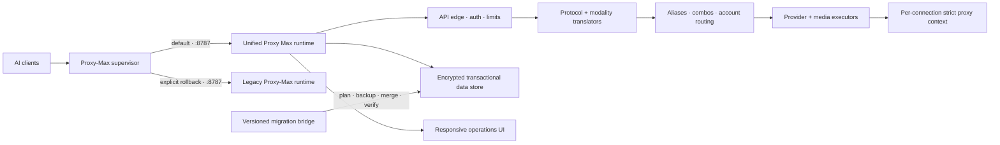

# Unified Proxy Max integration architecture

Proxy Max composes an immutable third-party v0.5.40 snapshot with a
reviewed overlay rather than copying selected features into the old server.
That preserves every upstream file and makes the selected implementation for
each path content-addressable. The composed standalone application is the
default runtime; the original Proxy-Max server remains a rollback boundary.



## Source composition

| Layer | Location | Contract |
| --- | --- | --- |
| Immutable source | `upstream/router-core` | Exact 1,342-file v0.5.40 Git-blob inventory |
| Proxy-Max changes | `overlays/unified` | Reviewed replacements and additions only |
| Runnable tree | `.proxy-max/runtime/unified` | Deterministic pinned-source + overlay composition |
| Evidence | `docs/parity/upstream-v0.5.40.ledger.json` | Path, digest, disposition, runtime target, gate |

`npm run verify:upstream` rejects a missing, changed, extra, duplicated, or
reordered pinned path. `npm run verify:parity` independently rejects a stale
overlay/materializer/ledger relationship. Neither hash gate is treated as proof
of runtime behavior; behavior is established by the test, build, smoke, and
browser gates.

## Runtime modes

| Mode | Selection | Port behavior |
| --- | --- | --- |
| Unified default | `npm start` | unified on `127.0.0.1:8787` |
| Legacy rollback | `PROXY_MAX_RUNTIME=legacy npm start` | old server on `127.0.0.1:8787` |
| Parallel | `npm run start:parallel` | legacy `:8787`, unified `:20128` unless overridden |
| Direct unified | `npm run start:unified` | unified `:20128` unless overridden |

`next` and `full` remain accepted aliases for the unified mode. The supervisor:

- requires Node 20.19.0 or newer for the unified process (the stricter floor
  required by the locked HTTP and test/build toolchain);
- validates that the standalone build matches the current materialized source;
- shards only the ephemeral build database by process and worker thread, so
  parallel static generation cannot race SQLite schema initialization;
- launches through the hardened `custom-server.js` without a shell;
- binds loopback by default and rejects spoofed forwarding context;
- isolates data at `~/.proxy-max/unified` or
  `PROXY_MAX_UNIFIED_DATA_DIR`;
- disables framework telemetry and does not run the upstream self-updater;
- forwards termination signals and bounds forced shutdown;
- keeps the legacy process and data untouched for rollback.

The direct `start:unified` command intentionally retains port 20128 for
side-by-side inspection; the supervisor supplies port 8787 at default cutover.

## Request lifecycle

1. The server validates host/origin/auth/locality/body limits and derives a
   request identity.
2. The selected provider connection is bound to the request, including proxy
   pool, no-proxy policy, strict mode, quota, and cooldown state.
3. The source protocol is detected and the destination transport is resolved
   from provider, endpoint mode, model metadata, and modality capability.
4. Remote image/PDF inputs are fetched only when translation requires inline
   bytes and only through the SSRF-hardened, bounded prefetch layer.
5. Translation preserves tool loops, reasoning, cache metadata, media blocks,
   usage, finish reasons, and streaming terminal events where the target can
   represent them.
6. Token-saving transforms run at the final request shape.
7. The specialized or registry executor runs inside the same request-scoped
   proxy context. Refreshes, model discovery, retries, and helper calls inherit
   that connection policy.
8. Provider output is normalized to the client protocol, logged without
   credentials, persisted transactionally, and charged to the bound account.

Forced-stream transports such as OpenAI Responses can still satisfy a JSON
client: the router streams upstream, validates/collects terminal events, then
returns the corresponding non-stream response.

## Provider preservation at cutover

The unified registry retains the broad upstream provider catalogue and adds
the Proxy-Max-specific paths that were previously only in the legacy server:

- AWS Bedrock uses native Anthropic payloads, SigV4 authentication, cross-region
  model IDs, and CRC-validated AWS EventStream translation.
- Azure supports deployment Chat Completions, resource Responses, direct
  Foundry Chat/Responses, full configured endpoint paths, API-key and Entra
  bearer authentication, and explicit dual-auth gateways.
- NVIDIA's standard endpoint stays native; custom endpoints become isolated
  OpenAI-compatible provider nodes.
- Cloudflare Workers AI retains its account-bound path.
- arbitrary legacy Bearer-authenticated OpenAI-compatible endpoints become
  isolated provider nodes instead of sharing mutable global configuration.

The existing Proxy-Max authorized-development credential guardrail is injected
idempotently into native Anthropic, OpenAI, Responses, Gemini, Vertex, and
Antigravity system-instruction shapes before translation.

## Migration contract

`npm run unified:migrate:plan` reads legacy configuration and writes:

- `migrations/proxy-max-to-unified-v1.private.json`: mode `0600`, includes the
  apply payload and credentials;
- `migrations/proxy-max-to-unified-v1.report.json`: mode `0600`, contains safe
  counts/mappings/warnings but no credential fields.

Planning does not modify either database. `npm run unified:migrate:apply`:

1. creates/uses private machine-bound CLI authentication;
2. starts a temporary loopback-only unified process;
3. exports a timestamped private backup;
4. merges provider connections, nodes, combos, and settings without deleting
   unrelated target data;
5. submits the upstream transactional import;
6. exports the result and verifies every planned connection ID;
7. terminates only the child process it created.

IDs and credential fingerprints are deterministic, so a repeated apply updates
the same imported objects rather than multiplying secrets or pool members. The
legacy source config is never removed.

## Security boundaries

- Management operations require dashboard authentication outside loopback,
  including when password-free local mode is selected. Privileged host
  operations additionally require a genuine local request; forwarded headers
  and a valid remote token cannot manufacture locality.
- Credentials are encrypted at rest and recursively redacted from API reads,
  exports, diagnostics, errors, and request logs.
- Import writes are serialized and transactional; corrupt/tampered encrypted
  records fail closed without deleting the last valid state.
- Strict proxy connections fail closed, including OAuth refresh and auxiliary
  provider calls. Proxy URLs are masked in logs.
- SSRF validation is applied at every redirect and DNS resolution. Remote media
  has timeout, signature/type, and decoded-size bounds.
- Updater, tunnel, PXPIPE, MITM, certificate, DNS, launcher, and autostart paths
  use bounded inputs, constrained destinations, exact managed-PID identity,
  and no fuzzy/broad process termination.

Platform-specific privilege prompts and trust stores still require validation
on real Windows, macOS, and Linux hosts. The management UI should remain on
loopback or behind a deliberately configured authenticated reverse proxy.

## Build and verification lifecycle

```sh
npm run verify:upstream
npm run unified:parity:gate
npm run test:unified
npm run unified:build
npm run unified:doctor
npm run unified:smoke
npm test
```

`npm run verify:full` runs that complete sequence. Final UI verification adds
rendered desktop/mobile browser checks, interaction smoke, and accessibility
inspection against the standalone server.

## Explicit upstream boundaries

The pinned repository references a cloud-sync backend that is absent from the
tracked source; Proxy Max neither invents nor contacts an undocumented service.
The optional Cursor host-MITM handler is an upstream `501` placeholder. Cursor
provider/AgentService routing is implemented, but that distinct interception
entry point remains visibly unavailable rather than pretending to work.
